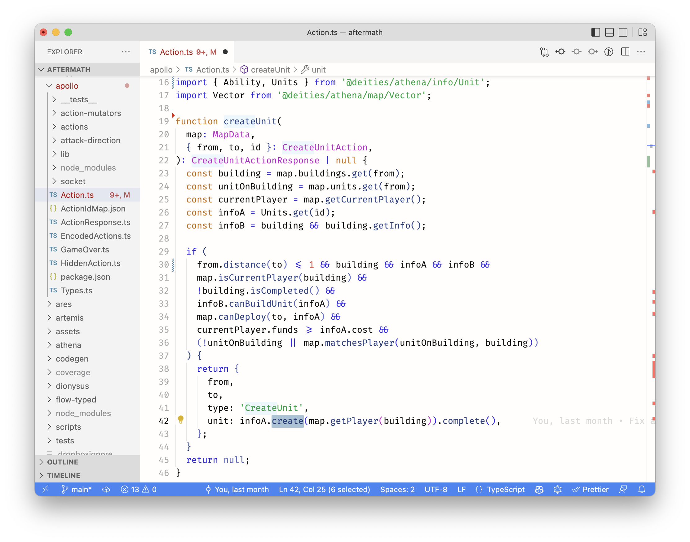
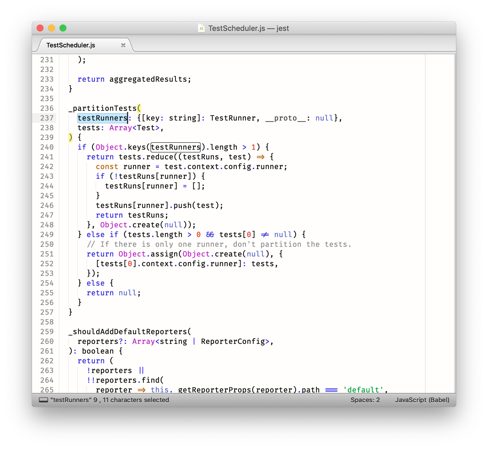
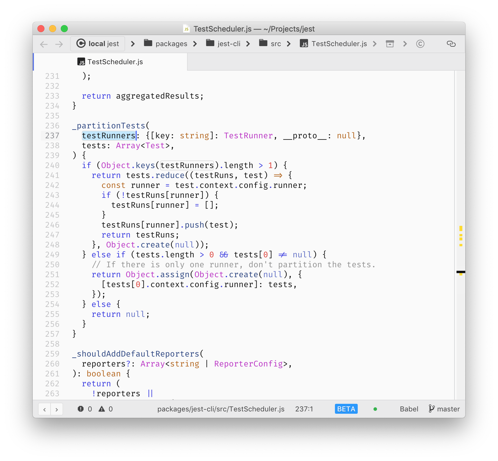

# licht theme

## VSCode

Install the [licht-theme VSCode extension](https://marketplace.visualstudio.com/items?itemName=cpojer.licht-theme)



## Sublime Text

Load the `.tmTheme` file from this repository in Sublime Text and set it as your color theme.


## Atom

Install the [licht-theme Atom extension](https://atom.io/themes/licht-theme)



## How to publish

```bash
vsce package --baseContentUrl https://github.com/cpojer/licht-theme --baseImagesUrl https://raw.githubusercontent.com/cpojer/licht-theme/master/
```
